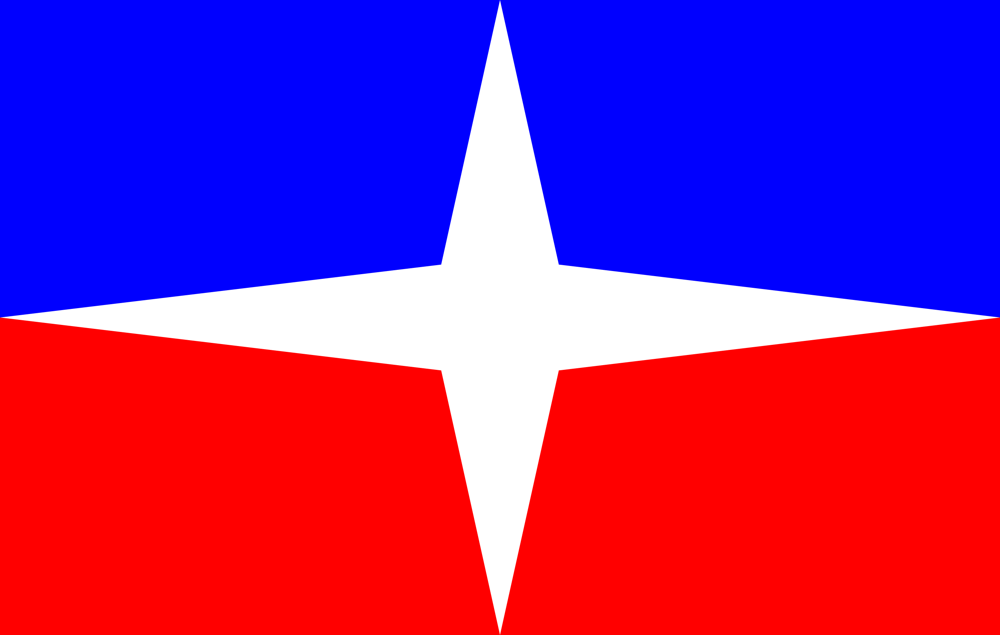

# Recursos para aprender interlingua

Una lista de recursos para aprender Interlingua, una lengua construida que conecta lenguas europeas.

 
 

 
 

## ℹ️ Information about Interlingua

[Official Site](https://www.interlingua.com/)

[🇬🇧 Omniglot](https://www.omniglot.com/writing/interlingua.htm)

[🇬🇧 Of Languages and Numbers](https://www.languagesandnumbers.com/how-to-count-in-interlingua/en/ina/)

[Wikipedia](https://es.wikipedia.org/wiki/Interlingua)

## 💬 Diccionarios y vocabulario

[Interlingua: A Dictionary of the International Language by Alexander Gode](https://archive.org/details/interlinguaengli00inte/mode/2up)

[Concise English–Interlingua Dictionary](https://www.interlingua.com/an/ceid/)

[English-Interlingua Dictionary by Josu Lavin (PDF)](https://panix.com/~bartlett/DICTIONARIO_ANGLESE-INTERLINGUA.pdf)

[English-Interlingua Dictionary by Josu Lavin (website)](https://interlingua.fandom.com/wiki/English-Interlingua_Dictionary)

[Interlingua English Dictionary revised by Stanley Mulaik](https://rudhar.com/lingtics/intrlnga/StanleyMulaik/IED-rev2/index.htm)

[List of grammatical words](https://www.interlingua.com/grammatica/grammatica/lista-de-particulas-grammatic/)

[English-Interlingua Dictionary (Interlingua Wikipedia)](https://ia.wikipedia.org/wiki/Usator:Melv_douc/dictionario_anglese-interlingua)

[Basic Interlingua English Dictionary](https://en.wikibooks.org/wiki/Interlingua/Basic_Interlingua_English_Dictionary)

### A list of English-Interlingua words
[Explanation (in Interlingua)](https://www.interlingua.com/grammatica/un-lista-de-parolas-anglese-interlingua/)

[English-Interlingua Vocabulary](https://www.interlingua.com/grammatica/vocabulario-anglese-interlingua/)

### Diccionarios buscables
[Multilingual Interlingua Dictionary (website of Ruud Harmsen)](https://rudhar.com/cgi-bin/cgi-grep.cgi)

[IEDICT Interlingua-English dictionary project (search tool)](http://www.denisowski.org/Interlingua/IEDICT/iedict_readme.html)

## 🔤 Gramatica

[Interlingua: A Grammar of the International Language by Alexander Gode](https://archive.org/details/interlingua-grammar/mode/2up)

[A Grammar of Interlingua (online version)](https://adoneilson.com/int/gi/)

[Interlingua Grammar (Wikipedia article)](https://en.wikipedia.org/wiki/Interlingua_grammar)

[Interlingua for Anglos by Stanley Mulaik](https://rudhar.com/lingtics/intrlnga/StanleyMulaik/Interlingua%20for%20Anglos%20Qui1.pdf)

[Summary of Interlingua Grammatical Forms](https://www.panix.com/~bartlett/Interlingua_Summary.html)

## 📇 Tarjetas educativas

[Interlingua 2500 (Anki)](https://ankiweb.net/shared/info/304285234)

[Interlingua vocabulary (Anki)](https://ankiweb.net/shared/info/1349681371)

[Interlingua 500 (Quizlet)](https://quizlet.com/310657213/interlingua-500-flash-cards/)

[Interlingua on Memrise community courses](https://community-courses.memrise.com/community/courses/english/?q=interlingua)

## 🏫 Courses

[Interlingua course for beginners](https://www.interlingua.com/es/curso/)

[Conversation Course (en interlingua y ingles 🇬🇧)](https://en.wikibooks.org/wiki/Interlingua/Curso_de_conversation)

["Interlingua a Prime Vista" by Alexander Gode](https://archive.org/details/interlingua_a_prime_vista)

## 📖 Reading Materials

[Wikipedia in Interlingua](https://ia.wikipedia.org/wiki/Pagina_principal)

[Textos exemplar](https://www.interlingua.com/grammatica/grammatica/appendices/textos-exemplar/)

[Libros electronicos (solo PDF)](https://www.interlingua.com/e-libros/)

[Historiettas e contos in interlingua (Short stories and tales in Interlingua)](https://ia.wikibooks.org/wiki/Historiettas_e_contos_in_interlingua)

[Collection of Interlingua Texts](https://www.panix.com/~bartlett/interlingua/)

[Algunos articulos en interlingua](https://wikisource.org/wiki/Main_Page/Interlingua/Articulos)

["Dece contos" por Alexander Gode](https://interlingua.fandom.com/wiki/Dece_contos_(A._Gode))

["Un dozena de breve contos" por Alexander Gode](https://interlingua.fandom.com/wiki/Un_dozena_de_breve_contos_(A._Gode))

[Lecturas (translations of various texts)](https://interlingua.fandom.com/wiki/Lecturas)

[Arias e cantos famose (traducciones de himnos y canciones)](https://interlingua.fandom.com/wiki/Arias_e_cantos_famose)

### Recursos pagados
[Litteratura in interlingua (fisico via Lulu)](https://www.interlingua.com/litteratura-in-interlingua/)

[Facile a leger in interlingua (fisico via Lulu)](https://www.interlingua.com/facilealeger/)

[Panorama (una revista, fisica y digital)](https://www.interlingua.com/panorama/)

## ✍️ Blogs
⚠️ **NOTE**: The majority of these blogs do not receive updates.

[Poemas e pensatas](https://poemasepensatas.blogspot.com)

[Blog personal de Peter Kovacs in interlingua](https://zalaegerszeg.blogspot.com/)

[Interlingua multilingue](https://interlinguamultilingue.blogspot.com/)

[Le Oculo Interlinguistic](https://oculointerlinguistic.blogspot.com/)

[Francisco Forgiamonte scribe in Interlingua](https://forgiamonte.blogspot.com/)

[Falcatorrosa](https://falcatorrosa2.blogspot.com/)

[Le blog de Erik Enfors in Interlingua](https://untorrente.blogspot.com/)

[Interlingua Scientia et Ecologia](https://interlingua-scientia.blogspot.com/)

[Interlingua Hispanic](https://interlinguahispanic.blogspot.com/)

## 🔨 Online Tools
[🇬🇧 Verbix (conjugador)](https://docs.verbix.com/Languages/Interlingua)

[Parlator de Interlingua (text to speech)](http://www.parlator.org/)

[Tatoeba (sentences in Interlingua)](https://tatoeba.org/es/sentences/show_all_in/ina/none)

[Forvo (Interlingua pronunciation dictionary)](https://es.forvo.com/languages/ia/)

[Interlingua Spell Checker for Firefox](https://addons.mozilla.org/ia/firefox/addon/corrector_orthographic/)

### Translators
[🇬🇧 Online Interlingua-English Translator](https://interlingua-translator.vercel.app/)

[Stars21 Interlingua Translator](https://www.stars21.com/translator/interlingua/)

[Online English Interlingua Translator](https://www.interlinguatranslate.org/dashboard/docs/pokus5.html)

## 🎥 Creadores
### Orlophe
[YouTube](https://www.youtube.com/@orlophe)

[TikTok](https://www.tiktok.com/@orlophe_vauchertres)

[Twitter](https://twitter.com/orlophe)

[Instagram](https://www.instagram.com/orlophe_interlingua/)

### Marcus Scriptor
[YouTube](https://www.youtube.com/@maluviam)

[Poemas e pensatas](https://poemasepensatas.blogspot.com)

## 👥 Comunidad
[Discord](https://discord.gg/e8FxURCx)

[Reddit](https://www.reddit.com/r/interlingua/)

### Grupos de Facebook
[Interlingua (IALA)](https://www.facebook.com/groups/interlingua.IALA/)

[Union Mundial pro Interlingua](https://www.facebook.com/interlingua.umi)

### Grupos de Telegram
[Interlingua (grupo más activo)](https://t.me/interlinguaiala)

[Interlingua](https://t.me/+3KVoLFMJRjVhZTYx)

## ❓ Otras cosas

[Radio Interlingua](https://www.interlingua.com/radio/)

[Proverbios](https://ia.wikipedia.org/wiki/Appendice:Lista_de_locutiones_e_proverbios)

[Malas palabras](https://en.wikibooks.org/wiki/Interlingua/Profanity)

[Ressources re Interlingua (enlaces a otras páginas y documentos que no están en esta lista)](https://rudhar.com/lingtics/intrlnga/resurses.htm)

[🇬🇧 Documents por Stanley Mulaik](https://rudhar.com/lingtics/intrlnga/StanleyMulaik/)

[Interlingua Wiki (¡Esto NO es Wikipedia!)](https://interlingua.fandom.com/wiki/Pagina_principal)

[Diccionarios, gramáticas y cursos (para hispanohablantes)](https://www.interlingua.com/instruction-national/#espaniol)

