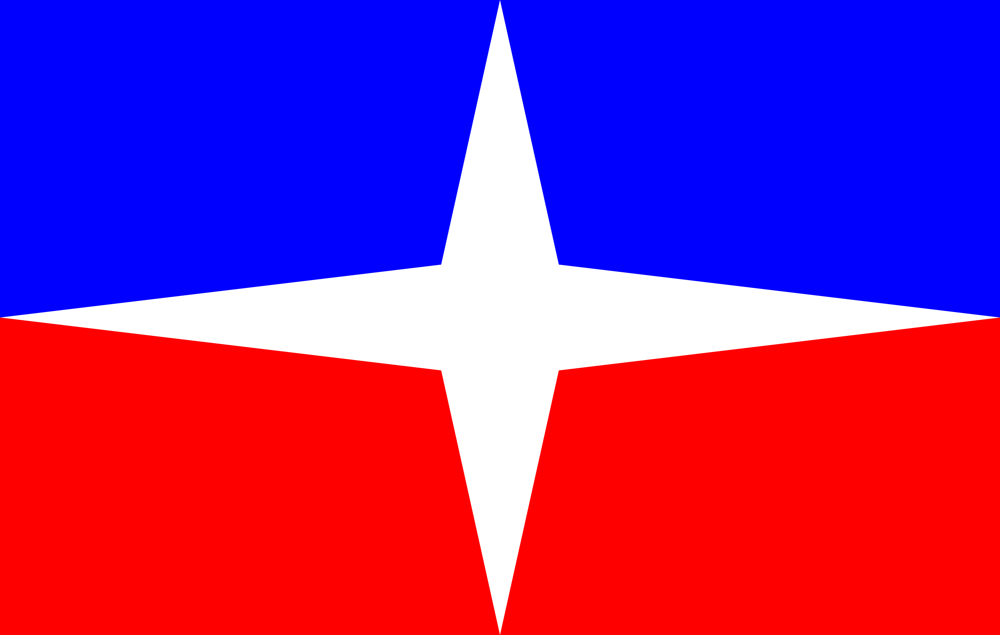

# Recursos para aprender interlingua

Una lista de recursos para aprender Interlingua, una lengua construida que conecta lenguas europeas.

 
 

 
 

⚠️ <b>ATENCIÓN</b>: Los recursos en inglés estarán marcados con una bandera. 🇬🇧

 
 

## ℹ️ Información sobre interlingua

[Sitio oficial](https://www.interlingua.com/)

[🇬🇧 Omniglot](https://www.omniglot.com/writing/interlingua.htm)

[🇬🇧 Of Languages and Numbers](https://www.languagesandnumbers.com/how-to-count-in-interlingua/en/ina/)

[Wikipedia](https://es.wikipedia.org/wiki/Interlingua)

## 💬 Diccionarios y vocabulario

[🇬🇧 Interlingua: A Dictionary of the International Language by Alexander Gode](https://archive.org/details/interlinguaengli00inte/mode/2up)

[Interlingua – diccionario básico de 2.500 palabras](https://www.interlingua.com/archivos/Interlingua%20-%20diccionario%20basico%20de%202.500%20palabras.pdf)

[Dictionario basic interlingua-espaniol](https://www.interlingua.com/archivos/es/Dictionario%20basic%20interlingua-espaniol.pdf)

[Diccionario español-interlingua](https://interlingua.fandom.com/wiki/Espaniol-Interlingua)

### Diccionarios buscables
[Diccionario multilingüe (sitio de Ruud Harmsen)](https://rudhar.com/cgi-bin/cgi-grep.cgi)

[🇬🇧 IEDICT Interlingua-English dictionary project](http://www.denisowski.org/Interlingua/IEDICT/iedict_readme.html)

## 🔤 Gramática

[🇬🇧 Interlingua: A Grammar of the International Language by Alexander Gode](https://archive.org/details/interlingua-grammar/mode/2up)

[🇬🇧 A Grammar of Interlingua (en línea)](https://adoneilson.com/int/gi/)

[Breve gramática y vocabulario de Interlingua](https://www.interlingua.com/archivos/es/Breve%20gramatica%20y%20vocabulario%20de%20Interlingua.pdf)

[Pequeña gramática de interlingua en español](https://www.interlingua.com/archivos/es/Pequena%20Gramatica%20de%20Interlingua%20en%20Espanol.pdf)

## 📇 Tarjetas educativas

### Memrise
[2500 Palabras Básicas Interlingua con Audio CARMUR](https://community-courses.memrise.com/community/course/2149096/2500-palabras-basicas-interlingua-con-audio-carmur/)

[Interlingua-Español Vocabulario del Curso + audio](https://community-courses.memrise.com/community/course/2149561/interlingua-espanol-vocabulario-del-curso-audio/)

## 🏫 Cursos

[Curso de interlingua para principiantes](https://www.interlingua.com/es/curso/)

[Curso de conversación (en interlingua e inglés 🇬🇧)](https://en.wikibooks.org/wiki/Interlingua/Curso_de_conversation)

["Interlingua a Prime Vista" por Alexander Gode](https://archive.org/details/interlingua_a_prime_vista)

## 📖 Material de lectura

[Wikipedia en interlingua](https://ia.wikipedia.org/wiki/Pagina_principal)

[Textos exemplar](https://www.interlingua.com/grammatica/grammatica/appendices/textos-exemplar/)

[Libros electrónicos (solo PDF)](https://www.interlingua.com/e-libros/)

[Historiettas e contos in interlingua](https://ia.wikibooks.org/wiki/Historiettas_e_contos_in_interlingua)

[Colección de textos en interlingua](https://www.panix.com/~bartlett/interlingua/)

[Algunos artículos en interlingua](https://wikisource.org/wiki/Main_Page/Interlingua/Articulos)

["Dece contos" por Alexander Gode](https://interlingua.fandom.com/wiki/Dece_contos_(A._Gode))

["Un dozena de breve contos" por Alexander Gode](https://interlingua.fandom.com/wiki/Un_dozena_de_breve_contos_(A._Gode))

[Lecturas (traducciones de varios textos)](https://interlingua.fandom.com/wiki/Lecturas)

[Arias e cantos famose (traducciones de himnos y canciones)](https://interlingua.fandom.com/wiki/Arias_e_cantos_famose)

### Recursos pagados
[Litteratura in interlingua (físico a través de Lulu)](https://www.interlingua.com/litteratura-in-interlingua/)

[Facile a leger in interlingua (físico a través de Lulu)](https://www.interlingua.com/facilealeger/)

[Panorama (una revista, física y digital)](https://www.interlingua.com/panorama/)

## ✍️ Blogs
⚠️ **ATENCIÓN**: La mayoría de estos blogs no reciben actualizaciones.

[Poemas e pensatas](https://poemasepensatas.blogspot.com)

[Blog personal de Peter Kovacs in interlingua](https://zalaegerszeg.blogspot.com/)

[Interlingua multilingue](https://interlinguamultilingue.blogspot.com/)

[Le Oculo Interlinguistic](https://oculointerlinguistic.blogspot.com/)

[Francisco Forgiamonte scribe in Interlingua](https://forgiamonte.blogspot.com/)

[Falcatorrosa](https://falcatorrosa2.blogspot.com/)

[Le blog de Erik Enfors in Interlingua](https://untorrente.blogspot.com/)

[Interlingua Scientia et Ecologia](https://interlingua-scientia.blogspot.com/)

[Interlingua Hispanic](https://interlinguahispanic.blogspot.com/)

## 🔨 Herramientas en línea
[🇬🇧 Verbix (conjugador)](https://docs.verbix.com/Languages/Interlingua)

[Parlator de Interlingua (texto a voz)](http://www.parlator.org/)

[Tatoeba (oraciones en interlingua)](https://tatoeba.org/es/sentences/show_all_in/ina/none)

[Forvo (diccionario de pronunciación)](https://es.forvo.com/languages/ia/)

[Corrector ortográfico para Firefox](https://addons.mozilla.org/es/firefox/addon/corrector_orthographic/)

### Traductores
[🇬🇧 Online Interlingua-English Translator](https://interlingua-translator.vercel.app/)

[Stars21 Interlingua Translator](https://www.stars21.com/translator/interlingua/)

[🇬🇧 Online English Interlingua Translator](https://www.interlinguatranslate.org/dashboard/docs/pokus5.html)

## 🎥 Creadores
### Orlophe
[YouTube](https://www.youtube.com/@orlophe)

[TikTok](https://www.tiktok.com/@orlophe_vauchertres)

[Twitter](https://twitter.com/orlophe)

[Instagram](https://www.instagram.com/orlophe_interlingua/)

### Marcus Scriptor
[YouTube](https://www.youtube.com/@maluviam)

[Poemas e pensatas](https://poemasepensatas.blogspot.com)

### Julio Toro
[YouTube](https://www.youtube.com/@juliotoro92)

[TikTok](https://www.tiktok.com/@juliotoro92)

### Kroyxt
[YouTube](https://www.youtube.com/@Kroyxt)

[TikTok](https://www.tiktok.com/@kroyxt)

## 👥 Comunidad
[Discord](https://discord.gg/yVzm2bh2jz)

[Reddit](https://www.reddit.com/r/interlingua/)

### Facebook
[Interlingua (IALA)](https://www.facebook.com/groups/interlingua.IALA/)

[Union Mundial pro Interlingua](https://www.facebook.com/interlingua.umi)

### Telegram
[Interlingua (grupo más activo)](https://t.me/interlinguaiala)

[Interlingua](https://t.me/+3KVoLFMJRjVhZTYx)

## ❓ Otras cosas

[Radio Interlingua](https://www.interlingua.com/radio/)

[Proverbios](https://ia.wikipedia.org/wiki/Appendice:Lista_de_locutiones_e_proverbios)

[Malas palabras](https://en.wikibooks.org/wiki/Interlingua/Profanity)

[Ressources re Interlingua (enlaces a otras páginas y documentos que no están en esta lista)](https://rudhar.com/lingtics/intrlnga/resurses.htm)

[🇬🇧 Documentos por Stanley Mulaik](https://rudhar.com/lingtics/intrlnga/StanleyMulaik/)

[Interlingua Wiki (¡Esto NO es Wikipedia!)](https://interlingua.fandom.com/wiki/Pagina_principal)

[Diccionarios, gramáticas y cursos (para hispanohablantes)](https://www.interlingua.com/instruction-national/#espaniol)

